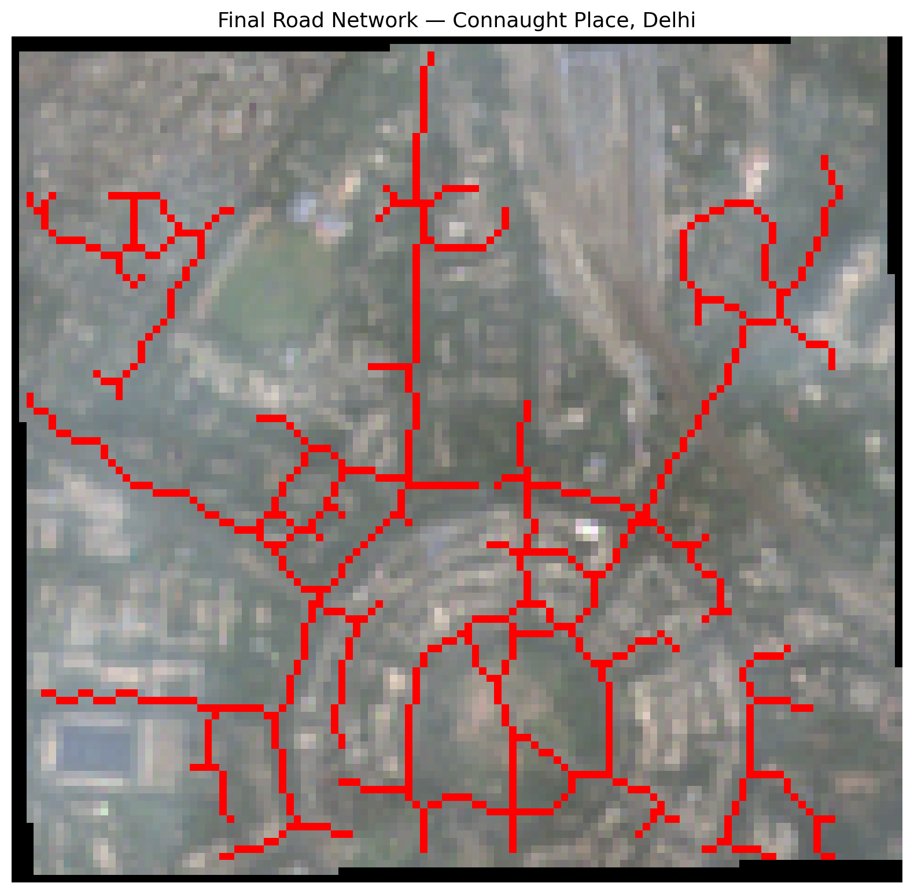

# Automatic Road Extraction from Satellite Imagery
**Sentinel-2 + U-Net Deep Learning Pipeline | Connaught Place, Delhi**

## Overview
An end-to-end deep learning pipeline for automatic road extraction from 
Sentinel-2 multispectral satellite imagery using a U-Net architecture.

## Pipeline
```
Sentinel-2 Image → Preprocessing → U-Net Training → Inference → Postprocessing → GeoJSON
```

## Results
Road network of Connaught Place, Delhi extracted at 10m resolution.



## Project Structure
```
├── src/
│   ├── model.py          # U-Net architecture
│   ├── train.py          # Training loop
│   ├── predict.py        # Sliding window inference
│   └── postprocess.py    # Morphological cleaning + vectorization
├── data/
│   └── processed/        # Sentinel-2 GeoTIFF
├── outputs/
│   ├── unet_road.pth     # Trained model weights
│   ├── roads.geojson     # Extracted road vectors
│   └── masks/            # Output rasters + visuals
├── requirements.txt
└── README.md
```

## Setup
```bash
pip install -r requirements.txt
```

## Run
```bash
python src/train.py
python src/predict.py
python src/postprocess.py
```

## Tech Stack
- PyTorch · Rasterio · GeoPandas · Scikit-image · Matplotlib
